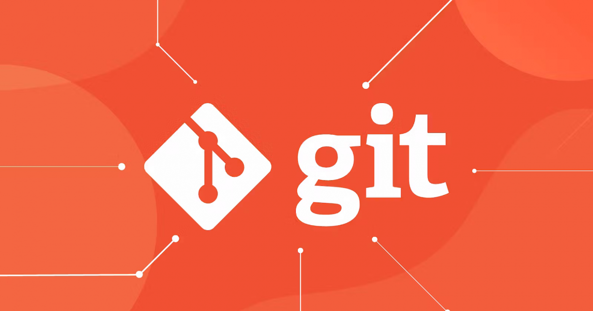

[< Вернуться назад](readme.md)

## Что же такое GIT?

**Git** — это распределенная система управления версиями с открытым исходным кодом для обработки любых проектов. Он прост в изучени и превосходит инструменты SCM, такие как Subversion, CVS, Perforce и ClearCase.

---

### Несколько особенностей GIT

1. Создание, слияние и удаление *локальных веток*, независимых друг от друга, занимает секунды.

2. С Git почти все операции выполняются *локально*, что дает ему огромное преимущество в скорости.

3. Есть возможность создавать множественные *резервные копии*.

4. Git имеет *промежуточную область*, где коммиты могут быть отформатированы и просмотрены перед завершением коммита.

---

---
GIT logo by Martin Heinz, license: [CC BY 4.0](https://creativecommons.org/licenses/by/4.0/)